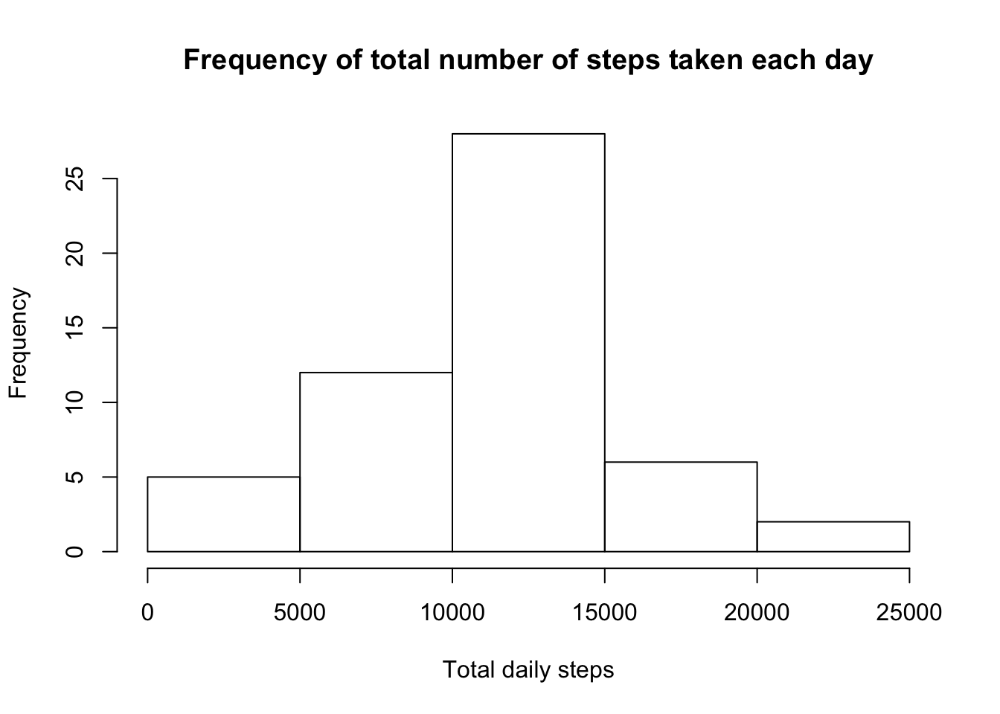
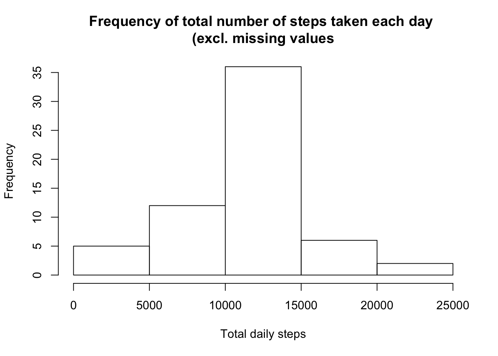
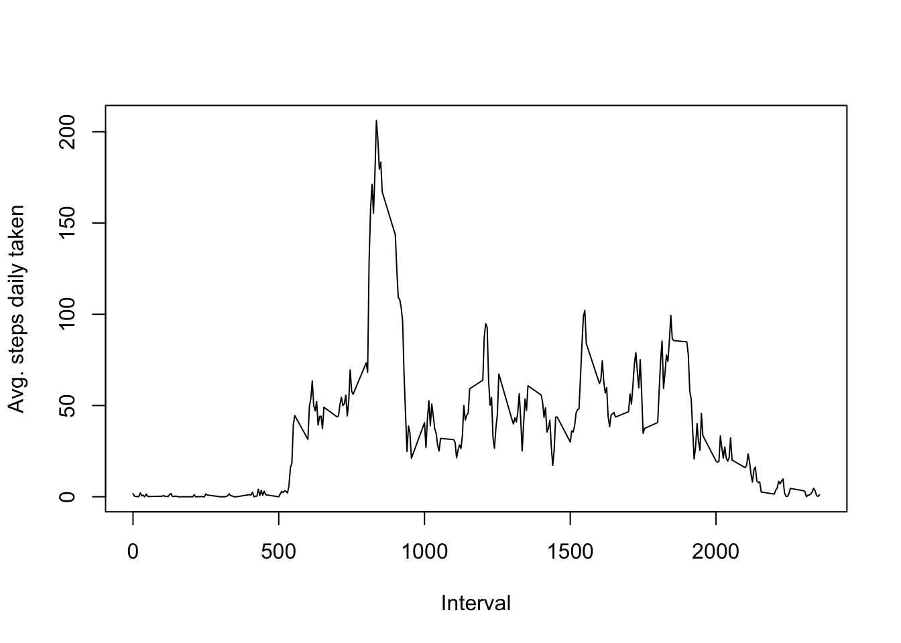
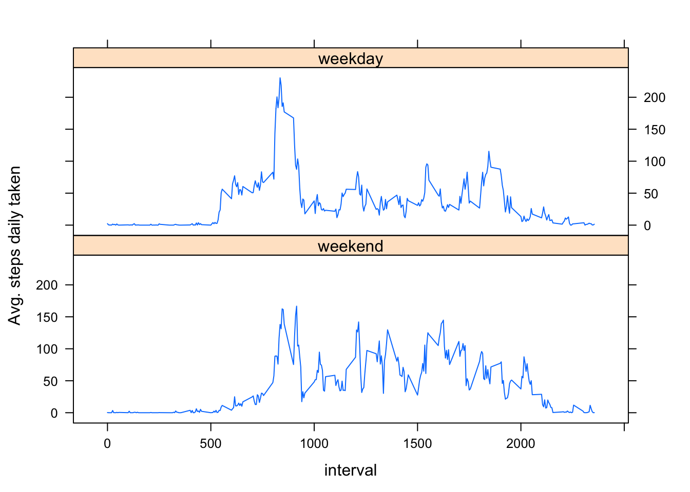

##1. Loading and preprocessing the data

Upload file from ./Data repository (where file has been downloaded) and create data frame


```r
fileName="activity.csv"
if (!file.exists("data")) {dir.create("data")}
filePath <- file.path("./Data",fileName)
rawData <- read.csv(filePath)
```

Change column 'date' class to date


```r
rawData$date <- as.Date(rawData$date,"%Y-%m-%d")
```

Create data frame to store total steps by date


```r
totalSteps <- aggregate(rawData$steps, by=list(rawData$date), sum)
names(totalSteps) <- c("date","sum")
```

##2. What is mean total number of steps taken per day?


```r
hist(totalSteps$sum, main="Frequency of total number of steps taken each day", xlab="Total daily steps")
```



Mean of total number of steps taken per day:


```r
mean(totalSteps$sum, na.rm = TRUE)
```

```
## [1] 10766.19
```

Median of total number of steps taken per day:


```r
median(totalSteps$sum, na.rm = TRUE)
```

```
## [1] 10765
```

##3. What is the average daily activity pattern?

###3.1 Imputing missing values

Identify how many observations with missing values for each variable


```r
colSums(is.na(rawData))
```

```
##    steps     date interval 
##     2304        0        0
```

Create a data frame containing average number of steps for each interval across all dates (excluding missing values)


```r
avgSteps <- aggregate(rawData$steps, by=list(rawData$interval), mean, na.rm = TRUE)
names(avgSteps) <- c("interval", "steps_mean")
```

Merge previous data frame with raw data, in order to have for each observation, average number of steps accross all dates for related observation interval


```r
newRawData <- merge(rawData, avgSteps, by=c("interval"))
```

If observation steps is NA then replace with steps_mean value


```r
newRawData[is.na(newRawData$steps),"steps"] <- newRawData[is.na(newRawData$steps),"steps_mean"] 
```

Remove steps_mean column and reorder column as initial raw data


```r
newRawData <- newRawData[,c(2,3,1)]
```

After missing value are processed


```r
newTotalSteps <- aggregate(newRawData$steps, by=list(newRawData$date), sum)
names(newTotalSteps) <- c("date","sum")
hist(newTotalSteps$sum, main="Frequency of total number of steps taken each day \n(excl. missing values", xlab="Total daily steps")
```



Mean of total number of steps taken per day:


```r
mean(newTotalSteps$sum, na.rm = TRUE)
```

```
## [1] 10766.19
```

Median of total number of steps taken per day:


```r
median(newTotalSteps$sum, na.rm = TRUE)
```

```
## [1] 10766.19
```

Inputing missing data on the estimates does not change average but median value

###3.2 Time series plot

Create a data frame containing average number of steps for each interval across all dates (after inputing missing data)


```r
newAvgSteps <- aggregate(newRawData$steps, by=list(newRawData$interval), mean)
names(newAvgSteps) <- c("interval", "steps_mean")
```

Create a plot


```r
with(newAvgSteps, plot(interval,steps_mean, type ="l", xlab="Interval", ylab="Avg. steps daily taken"))
```



Here is the 5-min interval with max daily average steps taken:


```r
newAvgSteps[which.max(newAvgSteps$steps_mean),"interval"]
```

```
## [1] 835
```

##4. Are there differences in activity patterns between weekdays and weekends?

Create a new factor variable in raw data with inputed missing values, to determine if date is week-end or week day


```r
newRawData$weekday <- factor(weekdays(newRawData$date) %in% c("Samedi","Dimanche"), levels=c(TRUE,FALSE), labels=c("weekend","weekday"))
```

Create a data frame containing the average number of steps taken, averaged across all weekday days or weekend days


```r
newAvgWeekdaySteps <- aggregate(newRawData$steps, by=list(newRawData$weekday,newRawData$interval), mean)
names(newAvgWeekdaySteps) <- c("weekday","interval","steps_mean")
```

Create a plot for each weekday type


```r
library(lattice)
xyplot(steps_mean~interval | weekday,data=newAvgWeekdaySteps, layout=c(1,2), type="l", ylab="Avg. steps daily taken") 
```



